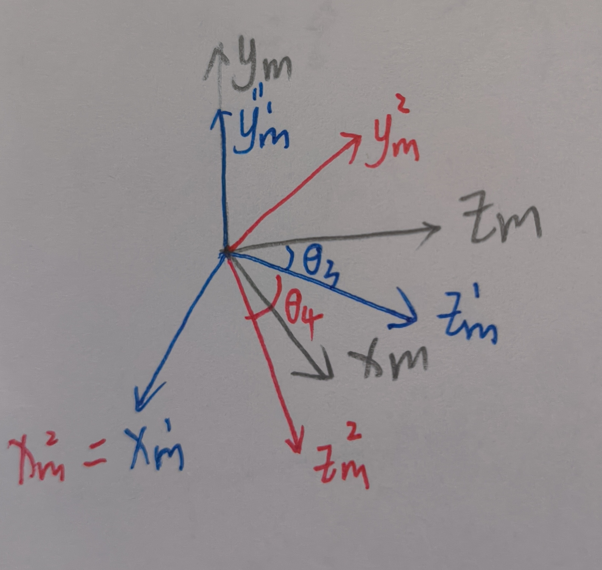

## DH建模方法复习：

* 坐标系配置需要满足条件：
  * 坐标轴 $x_{i+1}$ 垂直于坐标轴$z_i$
  * 坐标轴 $x_{i+1}$ 与坐标轴$z_i$相交
* 四个主要参数
  *  **a** 是轴 $z_i$ 与 $z_{i+1}$之间沿轴线 $x_{i+1}$ 之间的距离
  *  **$\alpha$** 是垂直于 $x_{i+1}$ 平面测得两个z轴之间的夹角，正向从 i 到 i+1
  *  **d** 是从坐标系i原点o到轴线 $x_{i+1}$与$z_i$交点 o' 之间的距离
  *  **$\theta$** 是垂直于$z_i$平面从两个x轴之间的夹角，同样遵循从低到高为＋

| link | $a_i$  | $\alpha_i$ | $d_i$                                 | $\theta_i$                                |
| ---- | ------ | ---------- | ------------------------------------- | ----------------------------------------- |
| 1    | 0      | 90         | **$d_1^*$** | 90                                        |
| 2    | a2     | 0          | d2                                    | $90+\theta_2^*$  |
| t2   | 0      | 90         | d_{t2}                                | $\theta_3^*$     |
| 3    | 0      | 0          | d_3                                   | 90                                        |
| t3   | a_{t3} | -90        | 0                                     | $-90+\theta_4^*$ |
| 4    | a_4    | -90        | 0                                     | -90                                       |
| 5    | 0      | 0          | -d5                                   | $\theta_5^*$     |

**$d_1^*$** : 0-130mm 

a2 = 218.55mm  ;  d2 = 60.1mm

d_{t2} = 165mm

d_3 = 90mm

a_{t3} = 90mm //为什么这两个不相等？

a_4 = 155

d5 = 15

添加extended系里坐标轴后的DH表：

| link | $a_i$  | $\alpha_i$ | $d_i$                                 | $\theta_i$                                | 对应从端坐标系 |
| ---- | ------ | ---------- | ------------------------------------- | ----------------------------------------- | -------------- |
| 1    | 0      | 90         | **$d_1^*$** | 90                                        |                |
| e0   | 0      | -90        | de0                                   | $\theta_2^*$     |                |
| e1   | 0      | 0          | de1                                   | 0                                         | $z_0$          |
| 2    | 0      | 90         | 0                                     | 0                                         |                |
| t2   | 0      | 90         | d_{t2}                                | $90+\theta_3^*$  |                |
| 3    | 0      | 0          | d_3                                   | 90                                        |                |
| t3   | a_{t3} | -90        | 0                                     | $-90+\theta_4^*$ |                |
| 4    | a_4    | -90        | 0                                     | -90                                       | $z_4$          |
| 5    | 0      | 0          | -d5                                   | $\theta_5^*$     | $z_5$          |

借助matlab计算得到二连杆部分（控制偏转）的齐次变换矩阵如下：

2-27结果：
$$
\begin{bmatrix} -sin(3),& -cos(3)*sin(4), & cos(3)*cos(4),&  -a4*sin(3) + d3*sin(3) + at3*cos(3)*cos(4)\\
cos(3),&  -sin(3)*sin(4),& cos(4)*sin(3),&  at3*cos(4)*sin(3) - d3*cos(3) + a4*cos(3)\\
         0,&   cos(4),&      sin(4),&                           dt2 + at3*sin(4) \\
        0,&                      0,&                       0,&                                                             1\end{bmatrix}
$$

---
3-2日修改了坐标系配置，计算新的结果如下：
$$
\begin{bmatrix} c_3,& -s_3*s_4, & -c_4*c_3,&  a_4*c_3 + d_3*c_3 - a_{t3}*s_3*c_4\\
0,&  c_4,& -s_4,&  a_{t3}*s_4*s_3 - d_{t2}\\
         s_3,&   c_3*s_4,&     c_3*c_4,&                     a_4*s_3 + d_3*s_3 + a_{t3}*c_3*c_4       \\
        0,&                      0,&                       0,&                                                             1\end{bmatrix}
$$

___

二连杆+小臂偏转部分（整体控制朝向）的齐次变换矩阵：
$$
[cos(2 + 3), -sin(2 + 3)*sin(4), -sin(2 + 3)*cos(4), a4*cos(2 + 3) + d3*cos(2 + 3) - a2*sin(2) - at3*sin(2 + 3)*cos(4)] \\
[sin(2 + 3),  cos(2 + 3)*sin(4),  cos(2 + 3)*cos(4), a4*sin(2 + 3) + d3*sin(2 + 3) + a2*cos(2) + at3*cos(2 + 3)*cos(4)] \\
[                   0,                      -cos(4),                       sin(4),                                                                                d2 + dt2 + at3*sin(4)] \\
[                   0,                                 0,                                  0, 1]
$$

$$
\begin{bmatrix}   c_4*s_5,&  c_4*c_5,   &    s_4,&    d2 + dt2 + at3*s_4 + d5*s_4 \\
s_{2 +3}*s_4*s_5 - c_{2 +3}*c_5,&  c_{2 + 3}*s_5 + s_{2 + 3}*c_5*s_4, & -s_{2 + 3}*c_4, &     d3*c_{2 + 3} - a4*c_{2 + 3} - a2*s_2 - at3*s_{2 + 3}*c_4 - d5*s_{2 +3}*c_4\\
- s_{2 + 3}*c_5 - c_{2 + 3}*s_4*s_5, & s_{2 + 3}*s_5 - c_{2 + 3}*c_5*s_4,&  c_{2 + 3}*c_4,& d1 - a4*s_{2 + 3} + d3*s_{2 + 3} + a2*c_2 + at3*c_{2 + 3}*c_4 + d5*c_{2 + 3}*c_4\\
 0,& 0, & 0, &1\end{bmatrix}
$$

由于两边旋转矩阵所得结果不同，因此尝试另外一种坐标系配备，并计算出对应的齐次变化矩阵如下：
$$
[-cos(3),  sin(3)*sin(4),  cos(4)*sin(3), a1*cos(3) - a3*cos(3) + at2*cos(4)*sin(3)] \\
[-sin(3), -cos(3)*sin(4), -cos(3)*cos(4), a1*sin(3) - a3*sin(3) - at2*cos(3)*cos(4)]\\
[           0,             -cos(4),              sin(4),                                               at2*sin(4)]\\
[           0,                        0,                        0,                                                             1]
$$

## 连续体

DH-table 

| link | $a_i$ | $\alpha_i$ |  $d_i$  |  $\theta_i$   |
| :--: | :---: | :--------: | :-----: | :-----------: |
|  1   |   0   |     90     |    0    | $\theta_1 ^*$ |
|  2   |   0   |    -90     |    0    | $\theta_2^*$  |
|  3   |   0   |     90     | $d_3^*$ |       0       |
|  4   |   0   |    -90     |    0    | $\theta_4^*$  |
|  5   |   0   |     0      |   -0    | $\theta_5^*$  |

$$
\theta_1 = -\theta_5 = \phi \\
\theta_2 = \theta_4 = \frac{ks}{2} \\
d_3 = \frac{2}{k} sin(\frac{ks}{2})
$$

## 控制策略

根据约束一中关系，我们需要根据主端手指朝向，计算该朝向下齐次变换中的旋转矩阵，由于主从两端朝向相同，因此在初始末端坐标系和世界坐标系相同的情况下，主从两边旋转矩阵部分应该相同。由于最终的旋转矩阵只有三个偏转关节决定，因此只需要考虑从坐标系$O_1$ 与 坐标系$O_4$ 之间的关系。其中坐标$O_1$ 对应的小臂偏转与手腕偏转完全独立，因此可以分开分析，以下推导主端关节变量$[\theta_2, \theta_3, \theta_4]^T$ 与 从端两端连续体变量$[k_1, s_1, \phi_2, k_2, s_2]^T$上述主端变量如图__ 所示，其中从端变量$k_1, s_1$ 分别表示近端连续体曲率和长度，由于近端只有在一个平面的自由度，因此对应的偏转角度为0，同理后面三个参数分别对应远端连续体偏转角度，曲率和长度。

#### 小臂偏转关节与近端连续体：

单独考虑小臂只有一个旋转过程，对应的旋转矩阵为$Rot (\hat{Z_1},\theta_2) $ ，
$$
Rot (\hat{Z_1},\theta_2) = \begin{bmatrix} \end{bmatrix}
$$
根据前文中连续体运动学建模结构，近端平面连续体齐次变化矩阵中的旋转矩阵$R_{s1}$
$$
R_{s1} =\begin{bmatrix} \end{bmatrix}
$$

#### 手腕偏转关节与远端连续体：

为了使得初始状态下末端与起始段坐标系关系一致，在现有坐标系基础上添加两个额外坐标系如下图：

**图片**

列出新坐标系对应的DH表：

| link | $a_i$  | $\alpha_i$ | $d_i$                                 | $\theta_i$                                | 对应从端坐标系 |
| ---- | ------ | ---------- | ------------------------------------- | ----------------------------------------- | -------------- |
| 1    | 0      | 90         | **$d_1^*$** | 90                                        |                |
| e0   | 0      | -90        | de0                                   | $\theta_2^*$     |                |
| e1   | 0      | 0          | de1                                   | 0                                         | $z_0$          |
| 2    | 0      | 90         | 0                                     | 0                                         |                |
| t2   | 0      | 90         | d_{t2}                                | $90+\theta_3^*$  |                |
| 3    | 0      | 0          | d_3                                   | 90                                        |                |
| t3   | a_{t3} | -90        | 0                                     | $-90+\theta_4^*$ |                |
| 4    | a_4    | -90        | 0                                     | -90                                       | $z_4$          |
| 5    | 0      | 0          | -d5                                   | $\theta_5^*$     | $z_5$          |

计算坐标系$O_4$ 在坐标系$O_{e1}$ 下的齐次变换矩阵 $ ^{e1} _4T$
$$
^{e1} _4T =\begin{bmatrix} c_3,& -s_3*s_4, & -c_4*c_3,&  a_4*c_3 + d_3*c_3 - a_{t3}*s_3*c_4\\
0,&  c_4,& -s_4,&  a_{t3}*s_4*s_3 - d_{t2}\\
         s_3,&   c_3*s_4,&     c_3*c_4,&                     a_4*s_3 + d_3*s_3 + a_{t3}*c_3*c_4       \\
        0,&                      0,&                       0,&                                                             1\end{bmatrix}
$$
同样根据之前连续体模型，可以得到远端连续体末端坐标系$O_p$与起事端坐标系$O_q$ 之间的齐次变化矩阵 $ ^q_pT$如下:
$$
^q_pT = \begin{bmatrix}c_{\phi2}*c_{k_2,s_2},& -s_{\phi_2},& -s_{k_2}*c_{\phi2},& -d_3*s_{\frac{k_2s_2}{2}}*c_{\phi2} \\
c_{k_2,s_2}*s_{\phi_2}, & c_{\phi2}, &-s_{k_2s_2}*s_{\phi_2},& -d_3*s_{\frac{k_2s_2}{2}}*s_{\phi_2} \\
        s_{k_2s_2},  &      0,             &           c_{k_2,s_2},    &      d_3*c_{k_2s_2/2}\\
              0,    &    0,            &                  0,          &           1 \end{bmatrix}
$$

通过观察$^{e1} _4T$ 和  $ ^q_pT$ ，其中旋转矩阵部分无法保证恒相等。为了解决该问题，对主从两端坐标系变换进行分析：为了便于理解，以下用欧拉角的方式对旋转变换进行描述。

 

由上图可以看出，主端二连杆的运动是由绕$y_m$轴偏航($R_{y_m,\theta_3}$)和 绕$x^1_m$轴俯仰$(R_{x^1_m,\theta_4})$ 组合而成；而连续体的坐标变换是由绕$z_a$轴滚动$(R_{z_a, \phi_2})$ 后绕$y^2_a$ 偏航$(R_{y^2_a,k_2s_2})$ ，再绕$z^2_a$ 滚动$(R_{z^2_a,-\phi})$ 。通过上述分析，可以知道主端只有俯仰和偏航的旋转，而从端只有滚动和偏航的旋转，两者无法等效。这里提出的解决方法是将主端的两次旋转分作两步分析，主端单独的偏航($R_{y_m,\theta_3}$)可以借助从端偏航$(R_{y^1_a,\theta_3})$描述，而主端的俯仰$(R_{x^1_m,\theta_4})$ 可以通过从端绕$z_a$滚动90°$(R_{z_a, \frac{\pi}{2}})$后再绕$y^2_a$ 偏航$\theta_4$ $y^2_a$ 偏航$(R_{y^2_a,\theta_4})$。从端需要进行两次坐标变换才能实现与主端同步，两次变换的参数需要满足以下关系：
$$
\begin{cases}
\begin{cases}
\phi^1_{2} = 0\\
k^1_2s^1_2 = \theta_3
\end{cases} \\

\begin{cases}
\phi^2_{2} = \frac{\pi}{2}\\
k^1_2s^1_2 = \theta_4
\end{cases}
\end{cases}
$$
**正负号规定：所有旋转角度正负号均遵守右手定则；**

注：由于曲率只能是正数，因此当$\theta_3,\theta_4$ 为负数时，$\phi^1_{2} = \pi, \phi^2_{2} = -\pi/2$

由此可以得到主端驱动空间 $AS_{master} = [d_1, \theta_2,\theta_3,\theta_4,\theta_5]^T$ 到从端构型空间 $CS_{slave = []} $
$$

$$
